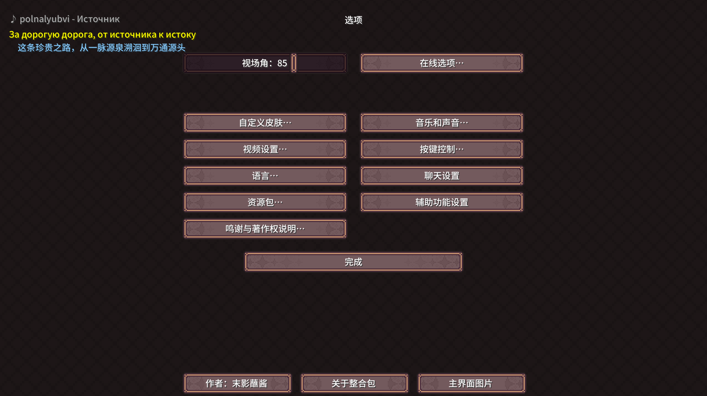

# LyricHUD

A Minecraft Forge mod that displays real-time lyrics and track information for the currently playing music.

<p align="center">
  
  
</p>

## Features

- Auto-identifies music from resource packs (filename parsing / AcoustID / ACRCloud)
- Displays track name and artist for instrumental music
- Shows bilingual LRC lyrics (original + Chinese translation) powered by NetEase
- Backport of Minecraft 1.21.6's official music HUD for Forge 1.20.1, with enhanced lyrics support
- Animated HUD (slide in 1s → display 5s → slide out 1s)
- Works on main menu and in-game
- One-click wrong lyric report, auto-skip on next play
- In-game config screen

## Install

1. Download `lyrichud-1.2.0.jar`
2. Put it in `.minecraft/mods/`
3. Requires Minecraft Forge 1.20.1 (47.x)

## Config

**Mods → LyricHUD → Config**:

- `show_hud`: Master HUD switch
- `acr_host / acr_key / acr_secret`: ACRCloud API (optional, 100 free queries/day, improves rare track identification)
- `report_wrong`: Toggle ON to report wrong lyrics

## Identification Pipeline

```
Music plays
  ├─ ① Filename → search NetEase/Kuwo for lyrics
  ├─ ② AcoustID fingerprint (free, unlimited)
  ├─ ③ ACRCloud (needs API key)
  └─ ④ No match → don't guess, show nothing
```

## Commands

- `/lyricreport`: Report current lyric as wrong, skip to next match next time

## License

GNU General Public License v3.0

Portions adapted from music-tag-web (GPL V3.0): https://github.com/xhongc/music-tag-web

Audio fingerprinting via AcoustID / Chromaprint.

Built with the assistance of DeepSeek V4.

---

# LyricHUD

Minecraft Forge 模组，在游戏内实时显示当前播放音乐的歌词和曲目信息。

<p align="center">
  
  
</p>

## 功能

- 自动识别资源包中的音乐（文件名解析 / AcoustID 音频指纹 / ACRCloud）
- 纯音乐显示曲名和艺术家
- 带歌词的歌显示网易云双语 LRC（原文 + 中文翻译）
- Minecraft 1.21.6 官方音乐 HUD 的 Forge 1.20.1 复刻，增强歌词支持
- HUD 弹入弹出动画（滑入 1s → 显示 5s → 滑出 1s）
- 主菜单和游戏内均可使用
- 歌词错误可一键报告，下次自动跳过错误匹配
- Mod 配置界面开关

## 安装

1. 下载 `lyrichud-1.2.0.jar`
2. 放入 `.minecraft/mods/` 文件夹
3. 需要 Minecraft Forge 1.20.1 (47.x)

## 配置

游戏中 **Mods → LyricHUD → Config** 可设置：

- `show_hud`：HUD 总开关
- `acr_host / acr_key / acr_secret`：ACRCloud API（可选，注册免费额度 100次/天，大幅提升冷门曲目识别率）
- `report_wrong`：拨到 ON 报告当前歌词错误

## 识别链路

```
音乐播放
  ├─ ① 文件名解析 → 网易云/酷我搜歌词
  ├─ ② AcoustID 音频指纹（免费，不限量）
  ├─ ③ ACRCloud（需配置 API key）
  └─ ④ 未匹配到 → 不显示，不猜测
```

## 命令

- `/lyricreport`：报告当前歌词错误，下次自动跳过

## 许可证

GNU General Public License v3.0

本项目部分代码移植自 music-tag-web (GPL V3.0)：https://github.com/xhongc/music-tag-web

音频指纹使用 AcoustID / Chromaprint。

在 DeepSeek V4 的协助下完成开发。
